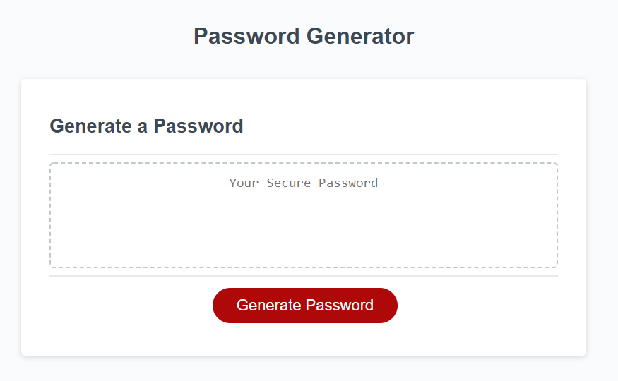

Project Random Password generator

The goal of this project was to create a random password generator in JavaScript. I was to get the length from the user and 4 different criteria. The criteria were uppercase, lowercase, special characters, and numbers. After the user decided on those criteria, I generated a random password using their input. 

I currently add each set of characters to the string for the random generation of the password. After the password is generated I check the password against each string that was to be included to ensure that it has that character. If it is missing a character I run the generate password code again.  

For further development I would like to add buttons on the page instead of using only alerts. I think this would create a better flow for the user. 

GitHub link: https://github.com/cloudflying87/passwordgenerator
deployed link:https://cloudflying87.github.io/passwordgenerator/